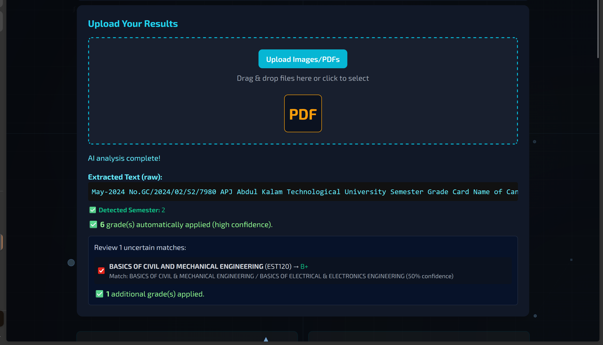

# KTU CGPA Calculator 🚀

An advanced, feature-rich CGPA calculator for KTU students with AI-powered grade card analysis. Built with a modern "nerd-tech" aesthetic for a delightful user experience.

---

## ✨ Features

### 🎯 Core Calculator Features
*   **Comprehensive CGPA/SGPA Calculator:**
    *   Supports multiple departments (CS, CE, AD, ME, EC, EE) with pre-configured subjects and credits.
    *   A "Universal" mode for custom subjects.
    *   Calculates SGPA for each semester and cumulative CGPA.
    *   Real-time updates as you select grades.
    *   Displays total credits earned.

*   **Accurate Internal Mark Calculator:**
    *   Calculates total internal marks based on series exams, assignments, and attendance.
    *   Follows the latest KTU regulations for mark distribution.

### 🤖 AI-Powered Features
*   **Smart Grade Card Analysis:**
    *   Upload PDF or image result cards for automatic grade extraction
    *   OCR support using Tesseract.js for image processing
    *   PDF text extraction using PDF.js
    *   Intelligent subject matching with confidence scoring
    *   Auto-fill grades with manual review for uncertain matches

*   **Privacy-First Design:**
    *   100% client-side processing - no data leaves your browser
    *   No server communication required
    *   No personal data storage or tracking

### 🎨 User Experience
*   **Stunning User Interface:**
    *   Modern, "nerd-tech" aesthetic with dynamic, animated background
    *   Glassmorphic design elements
    *   Responsive design that works on all devices
    *   Custom fonts and polished look and feel
    *   Intuitive tab-based navigation

---

## 🖼️ Screenshots

### 📊 Core Features
| CGPA Calculator | Internal Mark Calculator |
| :-------------: | :----------------------: |
|  |  |

### 🤖 AI-Powered Grade Analysis
| AI Grade Card Upload & Analysis |
| :-----------------------------: |
|  |
| *Upload your result card (PDF/image) and let AI automatically extract and apply grades* |

---

## 🛠️ Technologies Used

*   **Frontend:** HTML5, CSS3, Tailwind CSS
*   **JavaScript:** ES6+ with modern DOM manipulation
*   **AI Processing:** 
    *   Tesseract.js for OCR (client-side)
    *   PDF.js for PDF text extraction (client-side)
*   **Architecture:** 100% client-side, no backend required

---

## 🚀 How to Use

### CGPA/SGPA Calculator

1.  **Select your department:** Choose your engineering department from the dropdown menu
2.  **Choose input method:**
    *   **Manual Entry:** Select grades for each subject from dropdowns
    *   **AI Upload:** Upload your result card (PDF/image) for automatic grade extraction
3.  **View your results:** SGPA for each semester and overall CGPA calculated in real-time

### AI Grade Card Analysis

1.  **Upload your result card:** Drag & drop or click to select PDF/image files
2.  **AI processes your document:** OCR extracts text and identifies grades
3.  **Review matches:** High-confidence matches applied automatically, review uncertain ones
4.  **Confirm and apply:** Select which extracted grades to apply to your calculator

### Internal Mark Calculator

1.  **Switch to the "Internal Mark Calculator" tab**
2.  **Enter your marks:** Fill in series exams, assignments, and attendance percentage
3.  **See your total:** Total internal mark (out of 50) calculated instantly

---

## 🔒 Privacy & Security

*   **Client-side Processing:** All OCR and calculations happen in your browser
*   **No Data Transmission:** Your academic data never leaves your device
*   **No Storage:** No personal information stored anywhere
*   **No Tracking:** No analytics or tracking scripts

---

## 📋 Requirements

*   Modern web browser (Chrome, Firefox, Safari, Edge)
*   JavaScript enabled
*   For AI features: Support for Web Workers and File API

---

## 🤝 Contributing

1.  Fork the repository
2.  Create a feature branch
3.  Make your changes
4.  Test thoroughly
5.  Submit a pull request

---

## 📄 License

This project is licensed under the MIT License. See the [LICENSE](LICENSE) file for details.

---

## ⚠️ Disclaimer

This calculator is for educational purposes. Always verify important academic calculations with official university resources.

---

Built with ❤️ by Benedict.

---

## 🚀 How to Use

### CGPA/SGPA Calculator

1.  **Select your department:** Choose your engineering department from the dropdown menu. The subjects for all semesters will be loaded automatically.
2.  **Enter your grades:** For each subject, select the grade you received from the dropdown.
3.  **View your results:** The SGPA for each semester and your overall CGPA will be calculated and displayed in real-time.

### Internal Mark Calculator

1.  **Switch to the "Internal Mark Calculator" tab.**
2.  **Enter your marks:** Fill in your marks for the two series exams, two assignments, and your attendance percentage.
3.  **See your total:** The total internal mark (out of 50) will be calculated instantly.

---

## 📜 License

This project is licensed under the MIT License. See the [LICENSE](LICENSE) file for details.

---

Built with ❤️ by Benedict.
